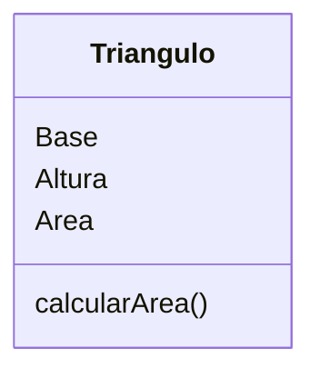

[[Introducción a la algorítmica y programación.]]

Durante esta etapa, el equipo de desarrollo documentará la solución de manera teórica. Identificará quiénes intervienen en el sistema, qué acciones deberán realizar en él, cómo será la interfaz con la que interactuarán y deberá ser capaz de definir cuáles son los posibles errores que puede cometer el usuario al interactuar con el sistema con la intención de encontrar soluciones durante el análisis.

A su vez, el desarrollador identificará que información es necesario obtener en el sistema y qué acciones se ejecutarán sobre esos datos (principio de abstracción). Se identificará el orden adecuado (a grandes rasgos) de las instrucciones que resolverán el sistema (algoritmos y diagramas de flujo). Se establecerán las partes del sistema (clases) y el flujo de información a través de dichas partes de acuerdo a los algoritmos planteados (en diagrama de secuencia).

### Casos de uso

### Detalles de caso de uso

1. El sistema crea un triángulo
2. El sistema solicita el valor de la base
3. El usuario proporciona el valor de la base
4. El sistema asigna el valor proporcionado al triángulo
5. El sistema solicita el valor de la altura
6. El usuario proporciona el valor de la altura
7. El sistema asigna el valor proporcionado al triángulo
8. El sistema solicita al triángulo el valor de su área
9. El sistema muestra al usuario el valor proporcionado por el triángulo

### Diagrama de estados

### Excepciones

• El valor de la longitud de la base debe ser distinto de cero.
• El valor de la longitud de la altura debe ser distinto de cero.
• El valor de la longitud de la base debe ser positivo.
• El valor de la longitud de la altura debe ser positivo.
• El área no puede ser cero o negativo.
• Los números deben estar escritos correctamente.

### Prototipo

### Diagrama de flujo

### Diagrama de secuencia

### Diagrama de clases básico

