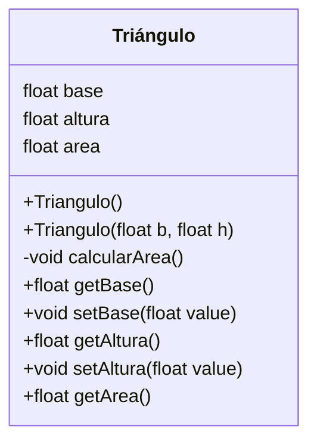

[[Introducción a la algorítmica y programación.]]

A partir de los requerimientos no funcionales que se obtuvieron en el planteamiento del problema y los productos que se obtienen del análisis, se plantea la arquitectura del sistema (qué elementos técnicos se necesitan para su implementación), se indican los mecanismos de lectura y escritura del estado del objeto (valor de cada atributo).

También, como se puede apreciar, en esta etapa se definen las pruebas (unitarias) que se ejecutarán sobre cada Clase para revisar si los métodos trabajan adecuadamente y sobre el sistema en su conjunto (pruebas de integración) para revisar que el programa haga lo de que se esperaba en el planteamiento y alcance del problema original.

### Arquitectura

• Uso de Java BlueJ.
• Uso de programa monousuario.
• Interfaz de consola para la ejecución.
• Vista separada de la lógica.

### Diagrama de clase desarrollado

### Diseño de pruebas unitarias y de integración

